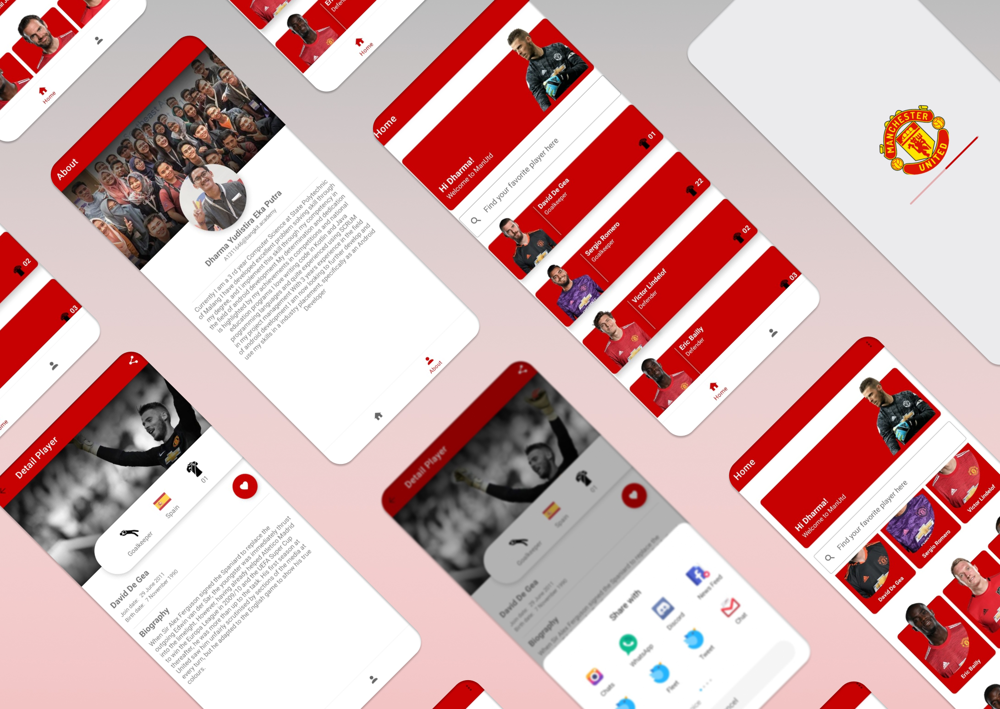

# Manchester United Profile

> <b>Warning</b>: this app built to accomplish #juaraandroid and "Belajar Membangung Aplikasi Android untuk Pemula" course which held by dicoding.com. Please be wise to clone and learn the flow of app. You are not allowed to copy/create derivatives/steal/sell this program codes.

### Overview
|</a> |</a>|</a>|
|:-----------:|:--------:|:--------:|
| Splash Screen | Home - List | Home - Grid |

|</a> |</a>|</a>|
|:-----------:|:--------:|:--------:|
| Search - List | Search - Grid | About |

|</a> |</a>|
|:-----------:|:--------:|
| Detail Screen | Share |

